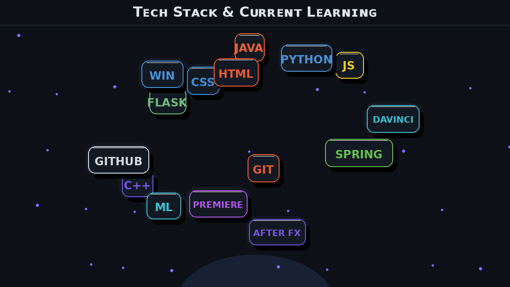

<div align="center">


<br/>


<br/><br/>

<p>


</p>

<br/>

<a href="https://github.com/priyanshuu-dev">

</a>

<a href="https://linkedin.com/in/priyanshu-raj-b44129309">

</a>

<a href="mailto:rajrthp123@gmail.com">

</a>

<a href="https://leetcode.com/priyanshuusinghh">

</a>

<br/><br/>


</div>

<br/>

---

<br/>

# About Me

```java
public class Priyanshu {

    String role = "Aspiring Backend Developer";

    String[] learning = {
        "Java",
        "Spring Boot",
        "SQL",
        "Data Structures & Algorithms"
    };

    String goal =
        "Build scalable applications and grow as a Software Engineer";
}
```

<br/>

I am a Computer Science student focused on backend development and problem-solving. I enjoy learning how applications work behind the scenes and building projects that turn concepts into real systems.

<br/>

- Building projects with Java and Spring Boot
- Strengthening backend fundamentals
- Practicing Data Structures and Algorithms
- Learning databases and API development
- Exploring real-world software architecture

<br/><br/>

---

<br/><br/>
<!-- ==================== TECH STACK ==================== -->

<div align="center">


# Tech Stack & Current Learning

<br>



<br><br>

### Current Focus

<p>
  
  
  
</p>

</div>

<br>

<h3>Currently Learning</h3>

<ul>
  <li>Building backend applications with Java and Spring Boot</li>
  <li>Strengthening Data Structures and Algorithms</li>
  <li>Learning how real-world backend systems are designed</li>
  <li>Improving problem-solving and clean coding skills</li>
  <li>Exploring creative tools and video editing alongside development</li>
</ul>

<h3>Goals</h3>

<ul>
  <li>Become confident in backend development and system design fundamentals</li>
  <li>Build strong real-world projects using Spring Boot</li>
  <li>Stay consistent with DSA and problem-solving</li>
  <li>Contribute to open-source projects</li>
  <li>Keep improving as a well-rounded software developer</li>
</ul>

<div align="center">


</div>

<!-- ================== END TECH STACK ================== -->

### Languages


<br/><br/><br/>

### Backend & Frameworks


<br/><br/><br/>

### Databases


<br/><br/><br/>

### Tools


</div>

<br/><br/>

---

<br/><br/>

# Current Focus

<div align="center">


</div>

<br/><br/>

<div align="center">

| Backend Development | Problem Solving |
|:---:|:---:|
| Spring Boot | DSA Patterns |
| REST APIs | Easy and Medium Problems |
| Databases | Interview Preparation |
| Backend Architecture | Consistent Practice |

</div>

<br/><br/>

---

<br/><br/>

# GitHub Analytics

<div align="center">


<br/><br/>


<br/><br/>


</div>

<br/><br/>

---

<br/><br/>
# Contribution Activity

<div align="center">

<picture>
  <source
    media="(prefers-color-scheme: dark)"
    srcset="https://raw.githubusercontent.com/priyanshuu-dev/priyanshuu-dev/output/github-contribution-grid-snake-dark.svg"
  />

  <source
    media="(prefers-color-scheme: light)"
    srcset="https://raw.githubusercontent.com/priyanshuu-dev/priyanshuu-dev/output/github-contribution-grid-snake.svg"
  />

  

</picture>

</div>

# LeetCode

<div align="center">

<a href="https://leetcode.com/priyanshuusinghh">


</a>

<br/><br/>

<a href="https://leetcode.com/priyanshuusinghh">


</a>

</div>

<br/><br/>

---

<br/><br/>

# Connect

<div align="center">

<a href="mailto:rajrthp123@gmail.com">

</a>

<a href="https://linkedin.com/in/priyanshu-raj-b44129309">

</a>

<a href="https://github.com/priyanshuu-dev">

</a>

<a href="https://leetcode.com/priyanshuusinghh">

</a>

</div>

<br/><br/><br/>

<div align="center">


<br/><br/>


</div>
